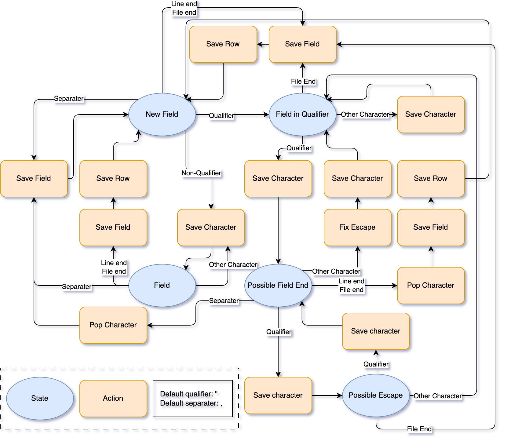

# csv_fix

[](https://pypi.org/project/csv_fix/)
[](https://pypi.org/project/csv_fix/)
[](https://github.com)


## Instruction

This script uses state machine to fix maleformed csv file.

```txt
Usage: csv_fix.py [Options] <filename>
Options and arguments:
  [-h/--help]: Show this message.
  [-s]: Define sperator. Defaults to comma.
  [-q]: Define text qualifier. Defaults to auto detect.
  [-t]: Trim white space at the beginning and end of each field. Defaults to double quote.
  [-z]: (Being constructed) Specify timezone for time fields. Defaults to server timezone. Can also be Asia/Chongqing etc.
        For standard timezone names, refer to: https://en.wikipedia.org/wiki/List_of_tz_database_time_zones
  [-k]: Skip errors and continue parsing following lines.
  <filename>: csv file name.
```

## Examples
```bash
# Input from stdin
cat test_case.csv | csv_fix
# Input from file
csv_fix -t test_case.csv
```
The processed output will be written to stdout.

## Features
### Fix Malformed CSV
Try to fix the format whenever possible. You can find test cases in `./tests/`.

The script follow this state machine to fix possible errors:



### Trim White Space

For fields that begin/end with white space can be stripped by specifying `-t`.

```bash
echo -n ' red,	yellow,green ,"red	"' | csv_fix -t
# Output: "red","yellow","green","red"
```

### Customize Seperator

Seperator can be customized. Specify seperator by `-s`.
```bash
echo -n 'A 27" monitor|"This should be good.|"|"' | csv_fix -s '|'
# Output: "A 27"" monitor"|"This should be good.|"|""
```

### Customize Qualifier
Qualifier can be customized. Specify qualifier by `-q`.
```bash
echo -n "'hello, what's up!','Not bad!'" | csv_fix -q "'"
# Output 'hello, what''s up!','Not bad!'
```